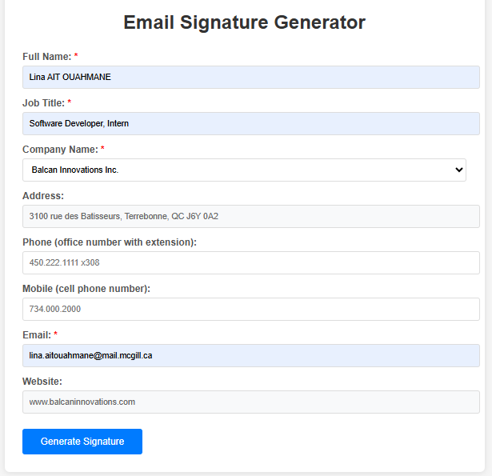
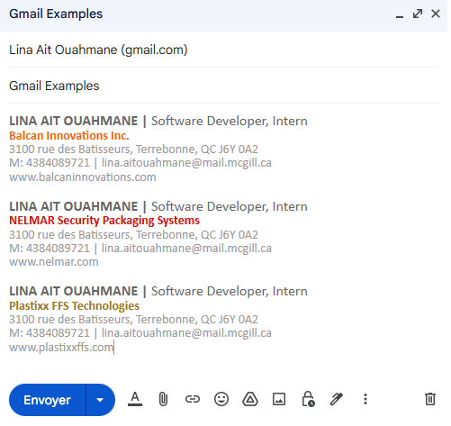
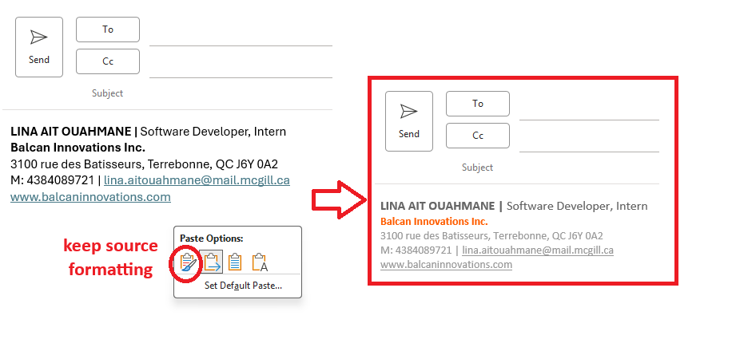

# ✍️ Email Signature Generator

## 📌 Overview

The Email Signature Generator is a web tool designed to help employees quickly create standardized, branded email signatures. It ensures consistency across communications by automatically applying company-specific branding, contact information, and formatting.

## ✨ Key Features

- Dynamic form with required fields for name, title, email, and contact numbers
- Company selection dropdown that auto-fills corporate address and website
- Brand-specific color integration for each company
- Responsive HTML signature preview with consistent formatting
- One-click copy functionality (compatible with Gmail, Outlook, and others)
- Optimized font scaling for legibility across email platforms

## 🏷️ Supported Brands

- **Balcan Innovations Inc.**
- **NELMAR Security Packaging Systems**
- **Plastixx FFS Technologies**

Each company entry includes:
- Corporate address
- Company website
- Brand color used in signature styling

## 📁 Folder Structure

```text
email-signature-generator/
├── index.html
├── style.css
├── script.js
├── README.md
├── images/
│   ├── Outlook.png
│   ├── Gmail.png
│   └── Website.png
```

## 🛠️ Usage Instructions

1. Open `index.html` in a web browser.
2. Complete the required fields:
   - Full name
   - Job title
   - Company selection
   - Email address
   - Optional phone/mobile details
3. Click **Generate Signature**.

🔍 Signature preview in the browser:

<p align="center">  </p>

4. Review the preview and click **Copy Signature** to place the HTML signature on your clipboard.
5. Paste the signature into your email client. For best results, choose “Keep Source Formatting” when pasting.

📧 Example in Gmail:

<p align="center">  </p>
💼 Example in Outlook:

<p align="center">  </p>

## 🧠 Technical Notes

- Font sizes are automatically scaled by a factor of 1.3 for consistency.
- The copy functionality uses the Clipboard API with fallback support.
- No external dependencies; this tool is self-contained and runs entirely in the browser.

